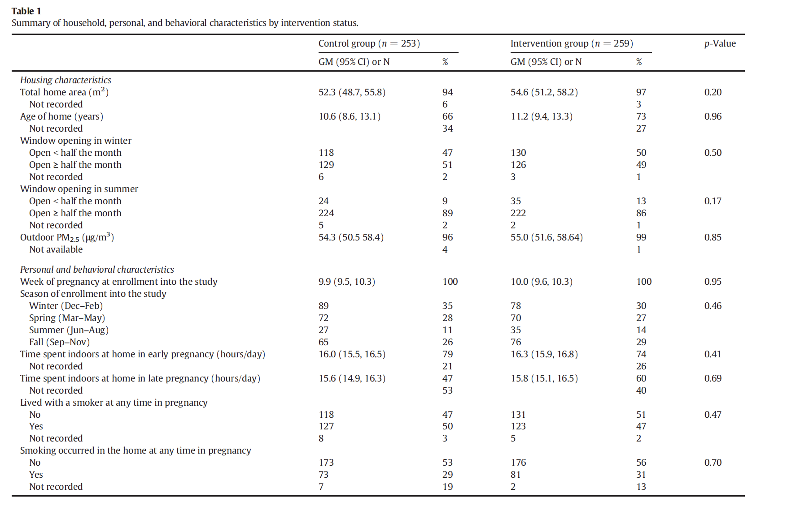

name:title
class:center, middle

---

[jump to title](#title)

---

# Highlights

- Interventions are needed to lower household PM2.5 exposures  
--

- Participants were randomized to a control (no air cleaners) or intervention (1–2 air cleaners) group
--

- Air cleaners lowered indoor PM2.5 by 29% and blood cadmium by 14% 
--

- Air cleaners were most effective in winter
--

- Air cleaner effectiveness reduced by >50% after ~ 5 months of use  

--

.center[]

---
# Background

- High Efficiency Particulate Air (HEPA) Filter
- We spend majority of our time indoors
- Outdoor Air Pollution + Indoor Sources (smoking)
- Studies in HICs
  - reductions of 32–68% in concentration
  - short term (days, weeks)
  
.center[]  

---
# Ulaanbatar, Mongolia

- Capital City
- Population: 1.5 million
- Cold and polluted
- Annual average PM2.5 concentration ~ 70 μg/m3
- Wintertime PM2.5 dominated by residential heating with coal
  - Coal combustion is also associated with Cadmium
  - Coal use rising with increase in "Ger" neighborhoods

.center[]

---
class: center, middle

# Quantify the impact of HEPA filter air cleaner use during pregnancy on indoor residential PM2.5, and blood cadmium concentrations.
---
.pull-left[
# Study Population
- Pregnant women >18 years

- Non-smoker

- Living in apartment

- Not using air cleaner at home

- Excluded women in "ger" area
  - no electricity for air filter
  - coal use 

]
.pull-right[
# Study Design
- 540 participants in each group

- Intervention household
  - 1 or 2 air purifiers
  - Disabled "mood-light"
  - timer data recorded
  - 1st purifier in living area and 2nd in bedroom 
  - HEPA filter was not changed during study
  
- Control household
 - no air purifier
 ]
 
---
# HEPA Filter
- High Efficiency Particle Filter
- Can remove at least 99.97% of dust, pollen, mold, bacteria, and any airborne particles with a size of 0.3 microns (µm)
- Minimum Efficiency Reporting Values, or MERVs
  - filter's ability to capture larger particles 
  - between 0.3 and 10 microns (µm)
  - value is helpful in comparing the performance of different filters
  - Higher MERV => better filter

.footnote[Source: https://www.epa.gov/indoor-air-quality-iaq/what-hepa-filter-1]
---

.left-column[HEPA Filter]
.right-column[]

.footnote[Source:https://en.wikipedia.org/wiki/HEPA]
---

# Data Collection
- Jan 2014 to Dec 2015
- At home and during clinic visits
- Dylos monitors for particle counts
- Gravimetric sampling in a subset of homes
- Blood samples for cadmium 
- Hair samples for nicotine (smoking exposure)

---
background-image: url("../images/dylos.jpeg")
background-position: right
background-size: 20%
# Air Pollution Measurements
- Dylos laser particle counter
  - 2 ranges: >0.5 μm and >2.5 μm
  - logging at 5 min intervals
- Real time count was disabled to avoid bias
- Used diff of the 2 rangess for PM2.5 concentration
 - Dylos-PM2.5 correlation is 0.55 and 0.99
- Conducted colocations of all monitors
- Gravimetric analysis
  - 90 apartments, 20% of sample
  - convinience sample
  - Harvard Personal Env Monitors (HEPM)
  - 37 mm Teflon filters
  - 4L/min
- Monitors were placed on table or shelf in main activity room 
  - far from air cleaner, pollution sources, ventilation
- Outdoor measurements were done at two locations 
  - Govt run stations
  - TOEM monitors
- RH measurements at a subset of apartments  
???
These apartments represent a convenience sample because although they
were randomly chosen to capture a representative sample of intervention
and control apartments across multiple seasons, measurements
were only conducted if participants gave permission for additional sampling.

---
background-image: url("images/shs.png")
background-size: 50%
background-position:100%, 50%
# Biological Samples
- Cadmium from blood samples
- Hair Nicotine
  - Marker of second hand tobacco smome
  - ~ 30-50 strands cut from scalp
  - Excluded people with chemically treated hair

.footnote[Image: Mohamed et al. 2018]

---
class:center, middle
# Randomized Control Trial

---
# Data Analysis

---
# Results

---
# Results - PM2.5 concentration
- Reduced one-week indoor PM2.5 by 29%
  - More reduction for first measurment (40%)
  - Less reduction for 2nd measurement (15%)
  
---

# Limitations
- Participants not blinded to intervention
  - sham filters
- HEPA filters not replaced during the study
- Could not assess duration of filter use
  - Timer was flawed
- Data loss due to malfunction of low cost Dylos device
  - 447 one-week indoor PM2.5 measurements in 342 apartments
---
class:center, middle
# Does the intervention lead to better health outcome?
---
class: center, middle
  

---
class:top

---
class:top
  

---
class: center, middle

# Questions?

